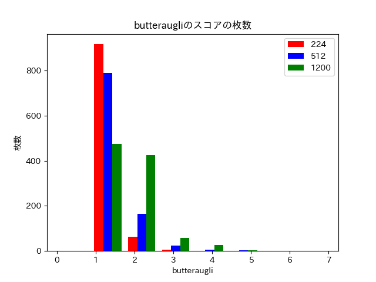

# Biscotti
[WIP]  
Perceptual JPEG encoder  
Faster Implement than [Guetzli](https://github.com/google/guetzli) with Deep Learning

## Description
Biscotti is a JPEG encoder that aims to be faster guetzli by using Deep Learning. Guetzli aims for excellent compression density at high visual quality. Guetzli can generate very high-quality image, but it is too slow to use for services. My goal is to make neural network that learn guetzli's compression patterns and to become faster than guetzli.

## Requirements
Python >= 3.0  
Keras == 2.1.3  
Tensorflow == 1.7.0  
numpy == 1.14.2  
opencv-python == 3.1.0  
pandas == 0.22.0  
matplotlib == 2.0.2  

run `pip install requirements.txt`

To make training dataset, you have to install [ImageMagick](https://www.imagemagick.org/script/index.php).

## Install
Biscotti have three dependent libraries.  
[butteraugli](https://github.com/google/butteraugli), [tensorflow](https://github.com/tensorflow/tensorflow) and [opencv](https://opencv.org/)
```sh
cd third_party

# clone
git clone https://github.com/tensorflow/tensorflow

# checkout
cd third_party/tensorflow
git checkout r1.7

# build tensorflow
bazel build -c opt --config=monolithic //tensorflow:libtensorflow_cc.so
```

## Usage
`biscotti [input_image].(jpg|png) [output_image].(jpg|png)`

## Training
### 1. Make Dataset
You should set your images(jpg) at `images/`  
After that, run `./train_bin/script/dump_qopt_images.sh`  
This script will make necessary folders  

**Note:** This script is very slow because of guetzli

### 2. Training
If you want to train unet, run `python src/train_unet.py [options]`
```
There are 5 options.
1. datasetpath .. training dataset path. if you run ./train_bin/script/dump_qopt_images.sh, write train/
2. outputfile .. keras output model. I recommend checkpoints/ directory.
3. batch_size .. batchsize is the number of training examples utilised in one iteration.(default 32)
4. epoch .. one pass of the full training set.(default 400)
```

### 3. evaluation
Please run `train_bin/Release/biscotti_dumper`.  
It will dump image coefficient after guetzli, and save csv/  
After that, run `python src/predict.py`

There are 8 options.
```
1. modelpath .. the file where you save your keras model.
2. imagepath .. image you want to evaluate.
3. targetsize .. image size you want to evaluate.(default 224) 
4. resultpath .. path which save results
5. csvpath .. path which save result csv
6. guetzli_csv_path
```

## Results
I evaluate biscotti with 1000 illust images. I prepare for different 3 sizes, 224, 512 and 1200.
I measure 3 indicator, average speed, change of filesize, and butteraugli score.

### average elapsed time(speed)
| filesize | guetzli | biscotti | libjpeg |
|:-----------|------------:|:------------:|:------------:|
| 224 | 6.49 | 1.07 | N/A |
| 512 | 25.24 | 3.23 | N/A |
| 1200 | 180 | 27.09 | N/A |


### change of filesize
purple line is `y=x`, and cyan line is `y=(1/2)x`  
biscotti can reduce 20% filesize  


### Butteraugli score
butteraugli score is rounded.  


## Support
- YUV420

## WIP
- alpha
- I will change method to evaluate. This method is not good.
- support YUV444, PNG(I have to train YUV444(convert jpg -> png, and make data))

## LICENSE
- This repo is under [Apache 2.0 License](https://www.apache.org/licenses/LICENSE-2.0).
- Biscotti is a fork of [guetzli](https://github.com/google/guetzli). The copyright of the original part is owned by Google, inc.

## Reference
- [guetzli](https://github.com/google/guetzli)
- [butteraugli](https://github.com/google/butteraugli)
